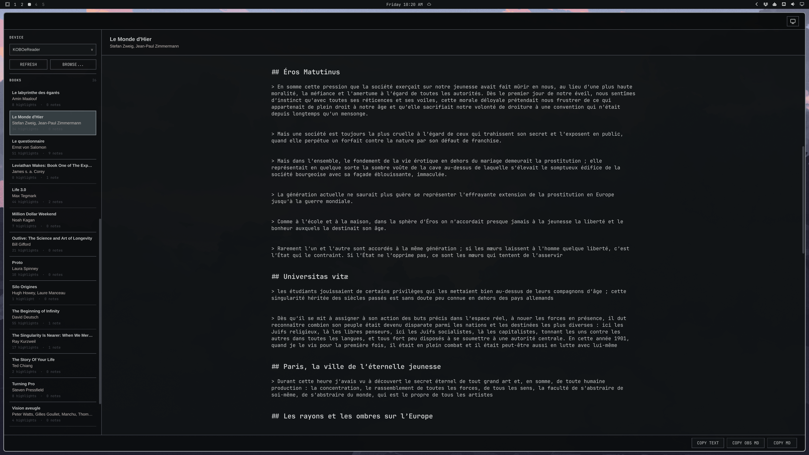

# kbextract

A small Linux desktop application for browsing and copying highlights and
notes from Kobo eReaders. It reads Kobo databases without modifying them and
produces standard Markdown, Obsidian-compatible Markdown, or plain text.



## Credits and project origin

kbextract began as an adaptation of
[Omadji](https://github.com/bjarneo/omadji), created by
[bjarneo](https://github.com/bjarneo). Full credit goes to bjarneo for Omadji
and the original application foundation that made this project possible.

Omadji provided the initial code organization, build foundation, basic QML
interface layout, and Omarchy theming. kbextract retained those foundations
while replacing Omadji's DJI media workflow with Kobo database discovery,
read-only annotation extraction, Markdown formatting, and clipboard export.

## Requirements

- A Linux desktop
- Qt 6.9 or later with QML, Quick, Quick Controls 2, SQLite, and SVG support
- CMake 3.21 or later
- A C++20 compiler

## Build and run

```bash
make build
make run
```

Install the executable and desktop entry under `~/.local` with:

```bash
make install
```

## Appearance

The app defaults to Omarchy mode and follows the active palette from
`~/.local/state/omarchy/current/theme/colors.toml`. Palette changes are picked
up while the app is running across backgrounds, controls, text, borders,
selection, and accents. The interface also follows Omarchy's caption, body,
and heading sizes from the active theme's `shell.toml`, with
`~/.config/omarchy/shell.toml` applied as the user override. Changes made with
`omarchy display text size` are picked up while the app is running. The
Markdown document keeps its own reading sizes. When Omarchy state is
unavailable, the app uses built-in palette and typography defaults.

Use the button in the header to cycle between Omarchy, light, and dark modes.
The selected mode is saved across launches.

## Kobo devices

On startup, the app looks for mounted volumes containing
`.kobo/KoboReader.sqlite`. Use `REFRESH` after connecting a device, or
`BROWSE...` to choose a database manually.

Databases are opened with SQLite's read-only mode. The sidebar lists only books
with visible highlights or notes and shows separate counts for each. A passage
with an attached note counts as a note rather than both a note and a plain
highlight.

## Annotation output

Select a book to open its annotation document. The read-only Markdown source
remains visible: highlighted passages use `> ` blockquote markers and notes are
plain paragraphs. Paired highlights and notes are separated by one blank line;
separate annotation records use two blank lines. Annotations from the same
chapter are grouped below a visible `## ` heading derived from Kobo's
navigation metadata. Split content files are grouped beneath their containing
chapter, and missing titles use `## Untitled chapter`. Heading lines are
displayed larger and bold while their markup remains visible.

Characters are kept unescaped, without injected Markdown escapes or HTML
entities. Single line breaks inside highlights are reflowed as spaces, while
blank lines remain paragraph boundaries and note line breaks remain unchanged.
The source can still be selected and copied with keyboard shortcuts.

The footer provides three complete-document copy formats:

- `COPY TEXT` copies plain text suitable for a word processor.
- `COPY OBS MD` copies Markdown with highlights formatted as Obsidian quote
  callouts.
- `COPY MD` copies standard Markdown with blockquoted highlights.

The reader soft-wraps at a centered maximum of 120 monospaced characters and
adapts to narrower windows without changing the copied source.

## Tests

```bash
ctest --test-dir build --output-on-failure
```

## License

Licensed under the [MIT License](LICENSE).
